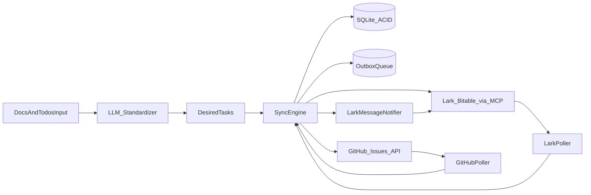
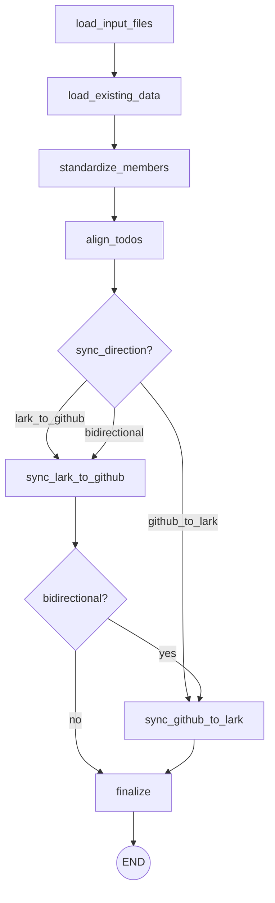

# SYSTEM_DESIGN

## Goals

- **Single source of truth**: GitHub Issues are the canonical task items; Lark Bitable is the operational task board.
- **Bidirectional sync**: Keep status/assignee/title/body aligned between GitHub and Lark.
- **ACID locally, eventual consistency remotely**: Use SQLite transactions for local correctness; use idempotent operations + outbox for external APIs.
- **Least privilege**: Separate GitHub and Lark credentials; never log secrets.

## Non-Goals (for the first iteration)

- Webhooks (GitHub/Lark) and real-time push (we start with polling + idempotency).
- Multi-repo orchestration (single repo first).
- Complex project management constructs (sprints, epics) (can be added later).

## High-Level Architecture



## Core Concepts

### Entities (Domain Model)

- **Employee**
  - `employee_id` (internal UUID)
  - `email` (for lookup)
  - `lark_open_id` (resolved via Lark Contact API)
- **Task**
  - `task_id` (internal UUID)
  - `title`, `body`
  - `status` (ToDo/InProgress/Done)
  - `assignee_email` (input) -> `assignee_open_id` (resolved)
  - `source` (docs/todos, manual, sync)
- **Remote Mapping**
  - `github_issue_number`
  - `lark_record_id`
  - `lark_table_id`, `lark_app_token`

### Status Mapping

- **Lark Status -> GitHub**
  - `Done` => GitHub `state=closed` and `state_reason=completed` (optional)
  - `To Do` / `In Progress` => GitHub `state=open`
- **GitHub -> Lark**
  - GitHub `state=closed` => Lark `Done`
  - GitHub `state=open` => Lark `To Do` (or keep `In Progress` if Lark already progressed)

Mapping is implemented as a pure function to satisfy SOLID (single responsibility and easy testability).

## Consistency Strategy (ACID + Outbox)

### Why Outbox
External APIs (GitHub, Lark) are not part of the local transaction. To avoid partial updates:

1. **Write intent** to SQLite in a single transaction:
   - Upsert Task
   - Upsert Mapping
   - Insert OutboxEvent(s)
2. **Dispatcher** reads OutboxEvent(s) and calls GitHub/Lark
3. On success, mark OutboxEvent as `sent` (also stored transactionally)

This yields:
- **Atomic local state** (ACID in SQLite)
- **Idempotent external calls** (safe retries)
- **Auditable sync log**

### Idempotency Keys

- **GitHub**
  - Prefer deterministic issue title prefix: `[AUTO][TaskId:<uuid>] ...`
  - Or store a mapping after creating the first time, and only update thereafter.
- **Lark**
  - Store `record_id` once created; updates are idempotent by record_id.

## Modules (SOLID-oriented)

- `src/config.py`
  - Reads env vars; validates presence; **never prints secrets**.
- `src/redact.py`
  - Redacts tokens/ids from logs before writing to `demos/`.
- `src/db.py`
  - SQLite schema + repositories; transaction helper.
- `src/mcp_client.py`
  - JSON-RPC stdio client for `npx @larksuiteoapi/lark-mcp ...`
- `src/lark_service.py`
  - Bitable operations (create app/table/records, search/update)
  - Contact lookup (email -> open_id)
  - Messaging operations (notify on drift)
- `src/github_service.py`
  - Issues lifecycle (create/read/update/comment/close/list comments)
- `src/sync_engine.py`
  - Orchestrates flows; uses DB and services; creates outbox events.
- `src/agent/` - LangGraph agent for workflow orchestration

## LangGraph Agent Architecture

The agent is built using LangGraph for stateful, graph-based workflow orchestration.

### Agent Graph



### Agent Nodes

| Node | Responsibility |
|------|---------------|
| `load_input_files` | Load project, members, and todos from `input/` YAML files |
| `load_existing_data` | Fetch existing GitHub issues, Lark records, and SQLite tasks |
| `standardize_members` | Resolve Lark open_id from email; save to SQLite |
| `align_todos` | Match new todos with existing issues/records; create task records |
| `sync_lark_to_github` | Create/update GitHub issues from todos |
| `sync_github_to_lark` | Create/update Lark records from todos |
| `finalize` | Summarize results, report errors |

### Input Folder Structure

```
input/
├── projects/           # Project configuration (GitHub/Lark targets)
│   └── example_project.yaml
├── todos/              # Todo items to sync
│   └── example_todos.yaml
└── members.yaml        # Team member mapping (email -> GitHub/Lark IDs)
```

### Running the Agent

```bash
# Default: bidirectional sync
python scripts/run_agent.py

# One-way sync
python scripts/run_agent.py --direction github_to_lark
python scripts/run_agent.py --direction lark_to_github

# Custom input
python scripts/run_agent.py --project input/projects/my_project.yaml
```

## SQLite Schema (initial)

Tables:
- `employees(email PRIMARY KEY, lark_open_id, created_at, updated_at)`
- `tasks(task_id PRIMARY KEY, title, body, status, source, assignee_email, assignee_open_id, created_at, updated_at)`
  - `source` can be: `docs`, `manual`, `github_sync`, `lark_sync`
- `mappings(task_id PRIMARY KEY, github_issue_number, lark_record_id, lark_app_token, lark_table_id, created_at, updated_at)`
- `outbox(event_id PRIMARY KEY, type, payload_json, status, attempts, last_error, created_at, updated_at)`
- `sync_log(id PRIMARY KEY, direction, subject, subject_id, status, message, created_at)`
- `sync_state(key PRIMARY KEY, value, updated_at)`
  - Stores polling cursors, e.g. `github_last_updated`, `lark_last_sync_ts`

## Failure Modes & Handling

- **API temporarily unavailable**: retry outbox with exponential backoff, cap attempts, alert via Lark message.
- **Permission errors**: fail fast, persist to `sync_log`, send operator notification.
- **Field mismatch in Bitable**: detect with `appTableField_list`, self-heal (create missing field only if configured), otherwise alert.
- **Encoding issues on Windows**: enforce UTF-8 env and `encoding='utf-8'` for files.

## Security Notes

- Never commit `.env` or any credential-bearing config.
- Prefer storing Lark MCP client id/secret in env and referencing them in runtime scripts.
- All demo logs under `demos/` must be redacted.

