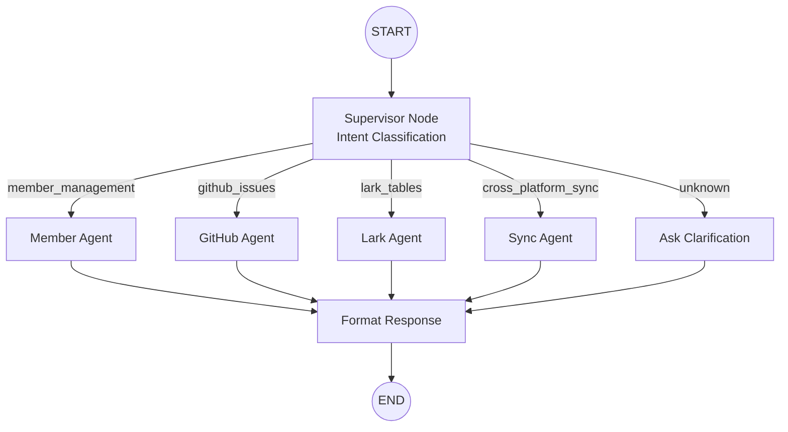

# Project Architecture (项目架构表)

> Version: 2.0 | Date: 2026-02-24
> Scope: Unified GitHub-Lark Agent System — Full Refactor

---

## 1. Architecture Overview

### 1.1 High-Level System Diagram

```
                          ┌─────────────────────────────────┐
                          │       User Chat Interface        │
                          │   (CLI / Cursor / API Endpoint)  │
                          └──────────────┬──────────────────┘
                                         │ Natural language command
                                         ▼
                          ┌─────────────────────────────────┐
                          │       LangGraph Supervisor       │
                          │     (Command Router Agent)       │
                          │                                  │
                          │  1. LLM Intent Classification    │
                          │  2. Entity Extraction            │
                          │  3. Route to Sub-Agent           │
                          └──────┬──────────┬───────────────┘
                                 │          │
                    ┌────────────┤          ├────────────────┐
                    ▼            ▼          ▼                ▼
             ┌──────────┐ ┌──────────┐ ┌──────────┐  ┌──────────┐
             │ Member   │ │ GitHub   │ │ Lark     │  │  Sync    │
             │ Agent    │ │ Agent    │ │ Agent    │  │  Agent   │
             └────┬─────┘ └────┬─────┘ └────┬─────┘  └────┬─────┘
                  │            │            │              │
                  ▼            ▼            ▼              ▼
             ┌─────────────────────────────────────────────────┐
             │              Service Layer (src/services/)       │
             │                                                  │
             │  MemberService  GitHubService  LarkService      │
             │                                                  │
             └───────────────────┬──────────────────────────────┘
                                 │
                  ┌──────────────┼──────────────┐
                  ▼              ▼              ▼
           ┌──────────┐  ┌──────────┐   ┌──────────┐
           │ SQLite   │  │ GitHub   │   │ Lark MCP │
           │ (ACID)   │  │ REST API │   │ (stdio)  │
           └──────────┘  └──────────┘   └──────────┘
```

### 1.2 Design Principles

| Principle | Application |
|-----------|-------------|
| **S** - Single Responsibility | Each agent handles one domain (members, GitHub, Lark, sync) |
| **O** - Open/Closed | New Lark tables added via config, not code changes |
| **L** - Liskov Substitution | All services implement common interfaces; agents are swappable |
| **I** - Interface Segregation | Agents only depend on the service methods they use |
| **D** - Dependency Inversion | Agents depend on service abstractions, not concrete implementations |
| **ACID** | All local DB writes are in explicit SQLite transactions |
| **Eventual Consistency** | External API calls go through outbox pattern |

---

## 2. Directory Structure (Target)

```
/workspace/
├── src/
│   ├── __init__.py
│   │
│   ├── config.py                       # Central config (enhanced, reused)
│   │
│   ├── models/                         # Domain models & DB schema
│   │   ├── __init__.py
│   │   ├── member.py                   # Member dataclass + TypedDict
│   │   ├── task.py                     # Task dataclass + TypedDict
│   │   ├── mapping.py                  # Mapping dataclass
│   │   └── lark_table_registry.py      # LarkTableConfig dataclass
│   │
│   ├── db/                             # Database layer (ACID)
│   │   ├── __init__.py
│   │   ├── database.py                 # Core SQLite connection + transactions
│   │   ├── schema.py                   # DDL definitions
│   │   ├── member_repo.py             # Member CRUD repository
│   │   ├── task_repo.py              # Task CRUD repository
│   │   ├── mapping_repo.py           # Mapping CRUD repository
│   │   ├── outbox_repo.py            # Outbox event repository
│   │   ├── sync_log_repo.py          # Sync log repository
│   │   └── lark_table_repo.py        # Lark table registry repository
│   │
│   ├── services/                       # External service clients
│   │   ├── __init__.py
│   │   ├── github_service.py          # GitHub REST API (enhanced)
│   │   ├── lark_service.py            # Lark Bitable via MCP (multi-table)
│   │   ├── mcp_client.py             # MCP JSON-RPC client (reused)
│   │   └── member_service.py          # Cross-platform member resolution
│   │
│   ├── agent/                          # LangGraph agents
│   │   ├── __init__.py
│   │   ├── supervisor.py              # Supervisor agent (command router)
│   │   ├── state.py                   # Shared AgentState TypedDict
│   │   ├── member_agent.py            # Member management sub-agent
│   │   ├── github_agent.py            # GitHub Issues sub-agent
│   │   ├── lark_agent.py             # Lark Tables sub-agent
│   │   ├── sync_agent.py             # Cross-platform sync sub-agent
│   │   └── tools/                     # LangGraph tool definitions
│   │       ├── __init__.py
│   │       ├── member_tools.py        # @tool functions for member ops
│   │       ├── github_tools.py        # @tool functions for GitHub ops
│   │       ├── lark_tools.py          # @tool functions for Lark ops
│   │       └── sync_tools.py          # @tool functions for sync ops
│   │
│   ├── sync/                           # Sync engine
│   │   ├── __init__.py
│   │   ├── engine.py                  # Outbox dispatcher + sync orchestration
│   │   ├── status_mapper.py           # Status mapping (pure functions)
│   │   └── field_mapper.py            # Field mapping for Lark↔GitHub conversion
│   │
│   └── utils/                          # Shared utilities
│       ├── __init__.py
│       ├── redact.py                  # Secret redaction (reused)
│       └── encoding.py               # UTF-8 enforcement helpers
│
├── scripts/
│   ├── run_agent.py                   # Main entry point (interactive mode)
│   ├── run_sync.py                    # Outbox dispatcher runner
│   ├── init_db.py                     # Database initialization
│   └── check_status.py               # System health check
│
├── input/                              # Static input files (retained for init)
│   ├── members.yaml                   # Initial team member definitions
│   ├── tables.yaml                    # Initial Lark table configurations
│   └── config.yaml                    # Project configuration
│
├── data/                               # Runtime data (gitignored)
│   └── sync.db                        # SQLite database
│
├── docs/
│   ├── REQUIREMENTS_ANALYSIS.md       # This document
│   ├── PROJECT_ARCHITECTURE.md        # This document
│   ├── CONFIG_KEYS.md                 # Configuration reference
│   └── API_SETUP.md                   # API setup guide
│
├── tests/                              # Test suite
│   ├── test_member_agent.py
│   ├── test_github_agent.py
│   ├── test_lark_agent.py
│   └── test_sync_engine.py
│
├── requirements.txt
├── .env.template
└── .gitignore
```

---

## 3. Component Architecture

### 3.1 LangGraph Agent Graph (Supervisor Pattern)



#### Supervisor Agent (`src/agent/supervisor.py`)

The supervisor is the entry point. It uses an LLM to classify user intent and extract entities, then delegates to the appropriate sub-agent.

```python
# Pseudocode — actual implementation uses LangGraph StateGraph
class SupervisorState(TypedDict):
    user_command: str
    intent: str          # member_management | github_issues | lark_tables | sync
    action: str          # create | read | update | delete | list | convert | view_work
    entities: dict       # extracted entities (name, email, issue_number, etc.)
    result: str          # formatted response to user
    error: Optional[str]
    messages: list[BaseMessage]
```

#### Intent Classification Prompt

```
Given the user command, classify the intent and extract entities.

Intents:
- member_management: add/show/update/remove members, view member's work
- github_issues: create/read/update/close/list issues, convert to lark
- lark_tables: create/read/update/list records, manage tables, convert to github
- cross_platform_sync: explicit sync commands, status propagation

Actions:
- create, read, update, delete, list, convert_to_lark, convert_to_github, view_work

Output JSON: {intent, action, entities: {name?, email?, issue_number?, ...}}
```

### 3.2 Sub-Agent Architecture

Each sub-agent is a LangGraph sub-graph with its own tools. The supervisor invokes sub-agents as nodes.

#### Member Agent (`src/agent/member_agent.py`)

```
┌──────────────────────────────────────┐
│            Member Agent              │
│                                      │
│  Tools:                              │
│  ├── create_member(name, email, ...) │
│  ├── get_member(email_or_name)       │
│  ├── update_member(email, **fields)  │
│  ├── delete_member(email)            │
│  ├── list_members(filters)           │
│  ├── view_member_work(email)         │
│  └── assign_member_table(email, tbl) │
│                                      │
│  Dependencies:                       │
│  ├── MemberService                   │
│  ├── MemberRepo                      │
│  ├── GitHubService (for work view)   │
│  └── LarkService (for work view)     │
└──────────────────────────────────────┘
```

#### GitHub Agent (`src/agent/github_agent.py`)

```
┌──────────────────────────────────────┐
│           GitHub Agent               │
│                                      │
│  Tools:                              │
│  ├── create_issue(title, body, ...)  │
│  ├── get_issue(number)               │
│  ├── update_issue(number, **fields)  │
│  ├── close_issue(number)             │
│  ├── reopen_issue(number)            │
│  ├── list_issues(filters)            │
│  ├── comment_on_issue(number, body)  │
│  └── convert_issue_to_lark(number,   │
│       target_table)                  │
│                                      │
│  Dependencies:                       │
│  ├── GitHubService                   │
│  ├── TaskRepo                        │
│  ├── MappingRepo                     │
│  └── LarkService (for conversion)    │
└──────────────────────────────────────┘
```

#### Lark Agent (`src/agent/lark_agent.py`)

```
┌──────────────────────────────────────┐
│            Lark Agent                │
│                                      │
│  Tools:                              │
│  ├── create_record(table, fields)    │
│  ├── get_record(table, record_id)    │
│  ├── update_record(table, id, flds)  │
│  ├── list_records(table, filters)    │
│  ├── list_tables()                   │
│  ├── create_table(name, fields)      │
│  ├── convert_record_to_github(       │
│  │   record_id, table)               │
│  └── register_table(app_token,       │
│       table_id, field_mapping)       │
│                                      │
│  Dependencies:                       │
│  ├── LarkService                     │
│  ├── TaskRepo                        │
│  ├── MappingRepo                     │
│  ├── LarkTableRepo                   │
│  └── GitHubService (for conversion)  │
└──────────────────────────────────────┘
```

#### Sync Agent (`src/agent/sync_agent.py`)

```
┌──────────────────────────────────────┐
│            Sync Agent                │
│                                      │
│  Tools:                              │
│  ├── sync_issue_to_lark(number)      │
│  ├── sync_record_to_github(rec_id)   │
│  ├── sync_all_pending()              │
│  ├── check_github_changes()          │
│  ├── check_lark_changes()            │
│  └── resolve_conflicts()             │
│                                      │
│  Dependencies:                       │
│  ├── SyncEngine                      │
│  ├── OutboxRepo                      │
│  └── SyncLogRepo                     │
└──────────────────────────────────────┘
```

---

## 4. Database Architecture

### 4.1 Schema DDL

```sql
-- Enable WAL mode for better concurrent read performance
PRAGMA journal_mode=WAL;
PRAGMA foreign_keys = ON;

-- ==========================================================================
-- Unified Member Table
-- ==========================================================================
CREATE TABLE IF NOT EXISTS members (
    member_id       TEXT PRIMARY KEY,
    name            TEXT NOT NULL,
    email           TEXT UNIQUE NOT NULL,
    github_username TEXT,
    lark_open_id    TEXT,
    role            TEXT NOT NULL DEFAULT 'member'
                    CHECK(role IN ('admin','manager','developer','designer','qa','member')),
    position        TEXT,
    team            TEXT,
    status          TEXT NOT NULL DEFAULT 'active'
                    CHECK(status IN ('active','inactive')),
    lark_tables     TEXT DEFAULT '[]',  -- JSON array of table assignments
    created_at      TEXT NOT NULL DEFAULT (strftime('%Y-%m-%dT%H:%M:%SZ','now')),
    updated_at      TEXT NOT NULL DEFAULT (strftime('%Y-%m-%dT%H:%M:%SZ','now'))
);

CREATE INDEX IF NOT EXISTS idx_members_email ON members(email);
CREATE INDEX IF NOT EXISTS idx_members_github ON members(github_username);
CREATE INDEX IF NOT EXISTS idx_members_lark ON members(lark_open_id);
CREATE INDEX IF NOT EXISTS idx_members_role ON members(role);

-- ==========================================================================
-- Task Table (enhanced)
-- ==========================================================================
CREATE TABLE IF NOT EXISTS tasks (
    task_id             TEXT PRIMARY KEY,
    title               TEXT NOT NULL,
    body                TEXT DEFAULT '',
    status              TEXT NOT NULL DEFAULT 'To Do',
    priority            TEXT DEFAULT 'medium'
                        CHECK(priority IN ('critical','high','medium','low')),
    source              TEXT DEFAULT 'manual',
    assignee_member_id  TEXT REFERENCES members(member_id),
    labels              TEXT DEFAULT '[]',  -- JSON array
    target_table        TEXT,               -- preferred lark table_id
    created_at          TEXT NOT NULL DEFAULT (strftime('%Y-%m-%dT%H:%M:%SZ','now')),
    updated_at          TEXT NOT NULL DEFAULT (strftime('%Y-%m-%dT%H:%M:%SZ','now'))
);

CREATE INDEX IF NOT EXISTS idx_tasks_assignee ON tasks(assignee_member_id);
CREATE INDEX IF NOT EXISTS idx_tasks_status ON tasks(status);

-- ==========================================================================
-- Mapping Table (enhanced for multi-table + multi-repo)
-- ==========================================================================
CREATE TABLE IF NOT EXISTS mappings (
    mapping_id          TEXT PRIMARY KEY,
    task_id             TEXT NOT NULL REFERENCES tasks(task_id),
    github_issue_number INTEGER,
    github_repo         TEXT,
    lark_record_id      TEXT,
    lark_app_token      TEXT,
    lark_table_id       TEXT,
    field_mapping       TEXT DEFAULT '{}',  -- JSON overrides
    sync_status         TEXT DEFAULT 'synced'
                        CHECK(sync_status IN ('synced','pending','conflict','error')),
    created_at          TEXT NOT NULL DEFAULT (strftime('%Y-%m-%dT%H:%M:%SZ','now')),
    updated_at          TEXT NOT NULL DEFAULT (strftime('%Y-%m-%dT%H:%M:%SZ','now'))
);

CREATE INDEX IF NOT EXISTS idx_mappings_task ON mappings(task_id);
CREATE INDEX IF NOT EXISTS idx_mappings_github ON mappings(github_issue_number);
CREATE INDEX IF NOT EXISTS idx_mappings_lark ON mappings(lark_record_id);

-- ==========================================================================
-- Lark Tables Registry (new)
-- ==========================================================================
CREATE TABLE IF NOT EXISTS lark_tables_registry (
    registry_id     TEXT PRIMARY KEY,
    app_token       TEXT NOT NULL,
    table_id        TEXT NOT NULL,
    table_name      TEXT NOT NULL,
    description     TEXT,
    field_mapping   TEXT NOT NULL DEFAULT '{}',  -- JSON field map
    is_default      INTEGER DEFAULT 0,
    created_at      TEXT NOT NULL DEFAULT (strftime('%Y-%m-%dT%H:%M:%SZ','now')),
    updated_at      TEXT NOT NULL DEFAULT (strftime('%Y-%m-%dT%H:%M:%SZ','now')),
    UNIQUE(app_token, table_id)
);

-- ==========================================================================
-- Outbox (unchanged — proven pattern)
-- ==========================================================================
CREATE TABLE IF NOT EXISTS outbox (
    event_id        TEXT PRIMARY KEY,
    event_type      TEXT NOT NULL,
    payload_json    TEXT NOT NULL,
    status          TEXT NOT NULL DEFAULT 'pending'
                    CHECK(status IN ('pending','processing','sent','failed','dead')),
    attempts        INTEGER NOT NULL DEFAULT 0,
    max_attempts    INTEGER NOT NULL DEFAULT 5,
    last_error      TEXT,
    created_at      TEXT NOT NULL DEFAULT (strftime('%Y-%m-%dT%H:%M:%SZ','now')),
    updated_at      TEXT NOT NULL DEFAULT (strftime('%Y-%m-%dT%H:%M:%SZ','now'))
);

CREATE INDEX IF NOT EXISTS idx_outbox_status ON outbox(status);
CREATE INDEX IF NOT EXISTS idx_outbox_type ON outbox(event_type);

-- ==========================================================================
-- Sync Log (unchanged — audit trail)
-- ==========================================================================
CREATE TABLE IF NOT EXISTS sync_log (
    id          TEXT PRIMARY KEY,
    direction   TEXT NOT NULL,
    subject     TEXT NOT NULL,
    subject_id  TEXT,
    status      TEXT NOT NULL,
    message     TEXT,
    created_at  TEXT NOT NULL DEFAULT (strftime('%Y-%m-%dT%H:%M:%SZ','now'))
);

CREATE INDEX IF NOT EXISTS idx_sync_log_subject ON sync_log(subject, subject_id);
CREATE INDEX IF NOT EXISTS idx_sync_log_created ON sync_log(created_at);

-- ==========================================================================
-- Sync State (unchanged — polling cursors)
-- ==========================================================================
CREATE TABLE IF NOT EXISTS sync_state (
    key         TEXT PRIMARY KEY,
    value       TEXT NOT NULL,
    updated_at  TEXT NOT NULL DEFAULT (strftime('%Y-%m-%dT%H:%M:%SZ','now'))
);
```

### 4.2 Entity-Relationship Diagram

```
┌──────────┐     1:N     ┌──────────┐     1:N     ┌──────────┐
│ members  │◄────────────│  tasks   │─────────────►│ mappings │
│          │  assignee   │          │   task_id    │          │
│ member_id│             │ task_id  │              │mapping_id│
│ email    │             │ title    │              │github_#  │
│ github   │             │ status   │              │lark_rec  │
│ lark_id  │             │ priority │              │lark_tbl  │
│ role     │             │ labels   │              │sync_stat │
│ lark_tbls│             │ target   │              │          │
└──────────┘             └──────────┘              └──────────┘
                                                        │
                                                        │ N:1
                                                        ▼
                                               ┌────────────────┐
                                               │lark_tables_reg │
                                               │                │
                                               │ app_token      │
                                               │ table_id       │
                                               │ table_name     │
                                               │ field_mapping  │
                                               └────────────────┘
```

---

## 5. Service Layer Architecture

### 5.1 MemberService (`src/services/member_service.py`)

Coordinates member operations across local DB and external platforms.

```python
class MemberService:
    """Cross-platform member management."""

    def __init__(self, db: Database, lark: LarkService, github: GitHubService): ...

    def create_member(self, name, email, role, ...) -> Member:
        """Create member + resolve lark_open_id + persist."""

    def get_member(self, identifier: str) -> Optional[Member]:
        """Lookup by email, name, or member_id."""

    def update_member(self, member_id, **fields) -> Member:
        """Update fields; re-resolve IDs if email changes."""

    def deactivate_member(self, member_id) -> None:
        """Soft-delete: set status='inactive'."""

    def list_members(self, role=None, team=None, status='active') -> list[Member]: ...

    def get_member_work(self, member_id) -> dict:
        """Aggregate GitHub issues + Lark records for a member."""

    def assign_table(self, member_id, table_id) -> None:
        """Add a Lark table to member's assignments."""
```

### 5.2 GitHubService (`src/services/github_service.py`)

Enhanced from current — adds member-aware operations.

```python
class GitHubService:
    """GitHub Issues API client."""

    # --- Existing (retained) ---
    def create_issue(self, title, body, labels, assignees) -> dict: ...
    def get_issue(self, number) -> dict: ...
    def update_issue(self, number, **fields) -> dict: ...
    def close_issue(self, number, reason) -> dict: ...
    def reopen_issue(self, number) -> dict: ...
    def create_comment(self, number, body) -> dict: ...
    def list_issues(self, state, labels, per_page, page) -> list[dict]: ...

    # --- New ---
    def list_issues_by_assignee(self, username, state='all') -> list[dict]: ...
    def search_issues(self, query) -> list[dict]: ...
```

### 5.3 LarkService (`src/services/lark_service.py`)

Enhanced for multi-table operations with table registry.

```python
class LarkService:
    """Lark Bitable multi-table operations via MCP."""

    # --- Existing (retained) ---
    def create_record(self, fields, app_token, table_id) -> dict: ...
    def search_records(self, filter_conditions, ...) -> list[dict]: ...
    def update_record(self, record_id, fields, ...) -> dict: ...
    def get_user_id_by_email(self, email) -> Optional[str]: ...

    # --- New ---
    def get_record(self, record_id, app_token, table_id) -> dict: ...
    def delete_record(self, record_id, app_token, table_id) -> dict: ...
    def search_records_by_assignee(self, open_id, app_token, table_id) -> list[dict]: ...
    def list_all_tables(self, app_token) -> list[dict]: ...
    def create_table_with_fields(self, name, fields, app_token) -> dict: ...
```

---

## 6. LangGraph Implementation Design

### 6.1 Agent State Definition

```python
class AgentState(TypedDict, total=False):
    # --- Input ---
    user_command: str                           # Raw user input

    # --- Parsed Command ---
    intent: str                                 # member_management | github_issues | lark_tables | sync
    action: str                                 # create | read | update | delete | list | convert | view_work
    entities: dict[str, Any]                    # Extracted entities

    # --- Execution Context ---
    current_agent: str                          # Which sub-agent is active
    tool_calls: list[dict[str, Any]]            # Tools called and results
    db_transaction_id: Optional[str]            # For tracking ACID operations

    # --- Result ---
    result: Optional[str]                       # Formatted response to user
    error: Optional[str]                        # Error message if any

    # --- LangGraph Internals ---
    messages: Annotated[list[BaseMessage], add_messages]
```

### 6.2 Supervisor Graph Construction

```python
from langgraph.graph import StateGraph, END
from langgraph.prebuilt import create_react_agent

def build_supervisor_graph() -> CompiledGraph:
    graph = StateGraph(AgentState)

    # Nodes
    graph.add_node("parse_command", parse_command_node)
    graph.add_node("member_agent", member_agent_node)
    graph.add_node("github_agent", github_agent_node)
    graph.add_node("lark_agent", lark_agent_node)
    graph.add_node("sync_agent", sync_agent_node)
    graph.add_node("format_response", format_response_node)
    graph.add_node("ask_clarification", ask_clarification_node)

    # Entry
    graph.set_entry_point("parse_command")

    # Routing
    graph.add_conditional_edges(
        "parse_command",
        route_by_intent,
        {
            "member_management": "member_agent",
            "github_issues": "github_agent",
            "lark_tables": "lark_agent",
            "cross_platform_sync": "sync_agent",
            "unknown": "ask_clarification",
        }
    )

    # All agents → format_response → END
    for agent_node in ["member_agent", "github_agent",
                       "lark_agent", "sync_agent", "ask_clarification"]:
        graph.add_edge(agent_node, "format_response")

    graph.add_edge("format_response", END)

    return graph.compile()
```

### 6.3 Tool Binding Pattern

Each sub-agent uses LangChain `@tool` decorated functions that wrap service calls:

```python
from langchain_core.tools import tool

@tool
def create_member(name: str, email: str, role: str = "member",
                  position: str = "", github_username: str = "") -> str:
    """Create a new team member with cross-platform identity resolution."""
    svc = get_member_service()
    member = svc.create_member(name=name, email=email, role=role,
                               position=position, github_username=github_username)
    return f"Member '{member.name}' created (ID: {member.member_id[:8]})"

@tool
def view_member_work(email_or_name: str) -> str:
    """View all GitHub issues and Lark records assigned to a member."""
    svc = get_member_service()
    work = svc.get_member_work_by_identifier(email_or_name)
    return format_work_summary(work)
```

Sub-agents are built using `create_react_agent` with their tool sets:

```python
from langgraph.prebuilt import create_react_agent

member_tools = [create_member, get_member, update_member,
                list_members, view_member_work, assign_member_table]

member_agent = create_react_agent(
    model=llm,
    tools=member_tools,
    state_modifier="You are the Member Management agent. ..."
)
```

---

## 7. Transaction & Consistency Architecture

### 7.1 Local ACID Pattern

Every operation that mutates local state uses explicit transactions:

```python
def create_member_and_task(self, member_data, task_data):
    with self.db.transaction() as conn:
        # Both writes in one atomic transaction
        member_id = self._insert_member(conn, member_data)
        task_id = self._insert_task(conn, task_data, assignee=member_id)
        self._insert_outbox_event(conn, "sync_github", {"task_id": task_id})
        # If any fails, entire transaction rolls back
    return member_id, task_id
```

### 7.2 Outbox Pattern (External Consistency)

```
┌─────────────┐   ACID TX   ┌─────────────┐
│ Service     │─────────────►│  SQLite     │
│ Operation   │              │             │
│             │    writes    │ • task      │
│             │─────────────►│ • mapping   │
│             │              │ • outbox    │
└─────────────┘              └──────┬──────┘
                                    │
                              ┌─────▼──────┐
                              │  Outbox    │
                              │  Dispatcher│
                              └─────┬──────┘
                                    │
                    ┌───────────────┼───────────────┐
                    ▼               ▼               ▼
              ┌──────────┐   ┌──────────┐   ┌──────────┐
              │ GitHub   │   │ Lark MCP │   │ Lark Msg │
              │ API      │   │ API      │   │ API      │
              └──────────┘   └──────────┘   └──────────┘
```

### 7.3 Outbox Event Types

| Event Type | Trigger | Action |
|-----------|---------|--------|
| `sync_github_create` | Task created, needs GitHub issue | Create issue via GitHub API |
| `sync_github_update` | Task updated, has GitHub mapping | Update issue via GitHub API |
| `sync_github_close` | Task status→Done, has GitHub mapping | Close issue |
| `sync_lark_create` | Task created, needs Lark record | Create record via Lark MCP |
| `sync_lark_update` | Task updated, has Lark mapping | Update record via Lark MCP |
| `convert_issue_to_lark` | User command | Read issue, create Lark record, store mapping |
| `convert_record_to_github` | User command | Read record, create GitHub issue, store mapping |
| `notify_member` | Sync event completed | Send Lark message to member |

### 7.4 Outbox Dispatcher

```python
class OutboxDispatcher:
    """Processes pending outbox events with retry and dead-letter."""

    def process_batch(self, limit=10):
        events = self.outbox_repo.get_pending(limit)
        for event in events:
            try:
                self.outbox_repo.mark_processing(event.event_id)
                handler = self._get_handler(event.event_type)
                handler(json.loads(event.payload_json))
                self.outbox_repo.mark_sent(event.event_id)
            except Exception as e:
                if event.attempts >= event.max_attempts:
                    self.outbox_repo.mark_dead(event.event_id, str(e))
                else:
                    self.outbox_repo.mark_failed(event.event_id, str(e))
```

---

## 8. Field Mapping Architecture

### 8.1 Default Field Mapping (configurable per table)

```json
{
  "title_field": "Task Name",
  "status_field": "Status",
  "assignee_field": "Assignee",
  "github_issue_field": "GitHub Issue",
  "last_sync_field": "Last Sync",
  "priority_field": "Priority",
  "description_field": "Description"
}
```

### 8.2 GitHub Issue → Lark Record Mapping

| GitHub Field | Lark Field | Transformation |
|-------------|------------|----------------|
| `title` | `title_field` | Strip `[AUTO][xxx]` prefix |
| `body` | `description_field` | Direct copy |
| `state` (open/closed) | `status_field` | `github_state_to_lark_status()` |
| `assignees[0].login` | `assignee_field` | Lookup member → `lark_open_id` → `[{"id": open_id}]` |
| `labels[].name` | _(mapped to priority/type)_ | `bug`→high, `feature`→medium, etc. |
| `number` | `github_issue_field` | Integer value |

### 8.3 Lark Record → GitHub Issue Mapping

| Lark Field | GitHub Field | Transformation |
|-----------|-------------|----------------|
| `title_field` | `title` | Add `[AUTO][task_id]` prefix |
| `description_field` | `body` | Direct copy |
| `status_field` | `state` | `lark_status_to_github_state()` |
| `assignee_field` | `assignees` | Lookup member → `github_username` |
| `priority_field` | `labels` | `high`→`priority:high`, etc. |

---

## 9. Configuration Architecture

### 9.1 Environment Variables (.env)

```env
# GitHub
GITHUB_TOKEN=                   # Required
OWNER=KataDavidXD               # Default
REPO=GithubAutoLark             # Default

# Lark MCP
LARK_MCP_CLIENT_ID=             # Required
LARK_MCP_CLIENT_SECRET=         # Required
LARK_MCP_DOMAIN=https://open.larksuite.com/
LARK_MCP_USE_OAUTH=true

# Lark Bitable (default table — can be overridden per operation)
LARK_APP_TOKEN=                 # Set after initial setup
LARK_TASKS_TABLE_ID=            # Set after initial setup

# LLM (for command parsing)
LLM_API_KEY=                    # Required
LLM_BASE_URL=                   # Optional
DEFAULT_LLM=gpt-4o-mini        # Default
```

### 9.2 Input YAML: `input/members.yaml`

```yaml
members:
  - name: Alice Chen
    email: alice@company.com
    github_username: alice-gh
    role: developer
    position: Frontend Lead
    team: frontend
    lark_tables:
      - table_name: Frontend Tasks

  - name: Bob Wang
    email: bob@company.com
    github_username: bob-gh
    role: developer
    position: Backend Developer
    team: backend
    lark_tables:
      - table_name: Backend Tasks
      - table_name: API Tasks
```

### 9.3 Input YAML: `input/tables.yaml`

```yaml
tables:
  - table_name: Frontend Tasks
    app_token: ${LARK_APP_TOKEN}
    table_id: tbl_frontend_001
    is_default: false
    field_mapping:
      title_field: Task Name
      status_field: Status
      assignee_field: Assignee
      github_issue_field: GitHub Issue
      last_sync_field: Last Sync

  - table_name: Backend Tasks
    app_token: ${LARK_APP_TOKEN}
    table_id: tbl_backend_001
    is_default: true
    field_mapping:
      title_field: Task Name
      status_field: Status
      assignee_field: Owner
      github_issue_field: GitHub Issue #
      last_sync_field: Synced At
```

---

## 10. Interaction Flow (End-to-End)

### 10.1 Full Command Processing Pipeline

```
1. User types: "Create issue 'Fix auth bug' assigned to Alice label:bug, send to lark Backend Tasks"

2. Supervisor.parse_command:
   → LLM classifies: intent=github_issues, action=create+convert_to_lark
   → Entities: {title: "Fix auth bug", assignee: "Alice", labels: ["bug"],
                convert_to_lark: true, target_table: "Backend Tasks"}

3. Supervisor routes → GitHub Agent

4. GitHub Agent:
   a. Resolve "Alice" → members table → github_username="alice-gh"
   b. Call github_service.create_issue(title="Fix auth bug",
        labels=["bug"], assignees=["alice-gh"])
   c. Store task + mapping in DB (ACID transaction)
   d. Detect convert_to_lark flag → enqueue outbox event

5. Outbox Dispatcher (immediate or deferred):
   a. Read outbox event: convert_issue_to_lark
   b. Lookup "Backend Tasks" in lark_tables_registry → app_token, table_id, field_mapping
   c. Map fields: title→"Task Name", status→"Status", assignee→Assignee(open_id)
   d. Call lark_service.create_record(...)
   e. Store Lark mapping in DB (ACID)
   f. Mark outbox event as sent

6. format_response:
   → "Issue #55 'Fix auth bug' created and assigned to Alice.
      Synced to Lark table 'Backend Tasks' (record: rec_xyz)."
```

---

## 11. Error Recovery Architecture

### 11.1 Error Categories and Handlers

| Category | Example | Handler |
|----------|---------|---------|
| **Auth Failure** | 401 from GitHub/Lark | Fail fast, report to user, log |
| **Not Found** | Issue #999 not found | Return user-friendly message |
| **Rate Limit** | 429 from APIs | Outbox retry with exp. backoff |
| **Network** | Connection timeout | Outbox retry (max 5 attempts) |
| **Validation** | Duplicate email | Return validation error |
| **MCP Crash** | Lark MCP process dies | Restart MCP, retry once |
| **Parse Failure** | LLM returns invalid JSON | Re-prompt with stricter format |
| **Conflict** | Both sides updated | Log conflict; last-write-wins |

### 11.2 Circuit Breaker for External Services

```python
class ServiceHealth:
    """Track external service health for circuit breaking."""

    def __init__(self, failure_threshold=3, reset_timeout=60):
        self.failures = 0
        self.threshold = failure_threshold
        self.reset_timeout = reset_timeout
        self.last_failure = None
        self.state = "closed"  # closed | open | half-open

    def record_failure(self): ...
    def record_success(self): ...
    def is_available(self) -> bool: ...
```

---

## 12. Migration Strategy

### Phase 1: Foundation (Database + Models)

| Step | Task | Files | Risk |
|------|------|-------|------|
| 1.1 | Define new models (`Member`, `Task`, etc.) | `src/models/` | Low |
| 1.2 | Create new schema DDL | `src/db/schema.py` | Low |
| 1.3 | Implement repository pattern for each table | `src/db/*_repo.py` | Low |
| 1.4 | Write migration script from old → new schema | `scripts/migrate_db.py` | Medium |
| 1.5 | Add `lark_tables_registry` support | `src/db/lark_table_repo.py` | Low |

### Phase 2: Services (Enhanced)

| Step | Task | Files | Risk |
|------|------|-------|------|
| 2.1 | Refactor `GitHubService` to new location | `src/services/github_service.py` | Low |
| 2.2 | Refactor `LarkService` for multi-table | `src/services/lark_service.py` | Medium |
| 2.3 | Create `MemberService` | `src/services/member_service.py` | Medium |
| 2.4 | Move `MCPClient` to services | `src/services/mcp_client.py` | Low |

### Phase 3: Agent System (Core Refactor)

| Step | Task | Files | Risk |
|------|------|-------|------|
| 3.1 | Define new `AgentState` | `src/agent/state.py` | Medium |
| 3.2 | Build Supervisor with intent classification | `src/agent/supervisor.py` | High |
| 3.3 | Build Member Agent + tools | `src/agent/member_agent.py` | Medium |
| 3.4 | Build GitHub Agent + tools | `src/agent/github_agent.py` | Medium |
| 3.5 | Build Lark Agent + tools | `src/agent/lark_agent.py` | Medium |
| 3.6 | Build Sync Agent + tools | `src/agent/sync_agent.py` | Medium |

### Phase 4: Integration & Polish

| Step | Task | Files | Risk |
|------|------|-------|------|
| 4.1 | Refactor `sync_engine` → `src/sync/` | `src/sync/` | Medium |
| 4.2 | Build interactive CLI runner | `scripts/run_agent.py` | Low |
| 4.3 | Write integration tests | `tests/` | Medium |
| 4.4 | Update documentation | `docs/` | Low |
| 4.5 | Deprecate old `src/agent/` linear pipeline | Remove old files | Low |

---

## 13. Technology Stack

| Component | Technology | Version | Purpose |
|-----------|-----------|---------|---------|
| Language | Python | 3.11+ | Core runtime |
| Agent Framework | LangGraph | >= 0.2.0 | Multi-agent orchestration |
| LLM Abstraction | LangChain Core | >= 0.3.0 | Tool/agent primitives |
| LLM Provider | OpenAI-compatible | Any | Command parsing + routing |
| Database | SQLite (WAL) | Built-in | ACID local store |
| GitHub API | REST (requests) | v3 | Issues CRUD |
| Lark API | MCP (JSON-RPC stdio) | @larksuiteoapi/lark-mcp | Bitable + Contact + Messaging |
| Config | python-dotenv | >= 1.0.0 | Environment management |
| Data Format | YAML + JSON | — | Config + payloads |

---

## 14. Security Architecture

| Concern | Mitigation |
|---------|------------|
| Secret leakage | `.env` gitignored; `redact.py` strips tokens from logs |
| API token scope | GitHub PAT with `repo` scope only; Lark with minimal permissions |
| SQL injection | Parameterized queries only; no string interpolation in SQL |
| Input validation | All user commands validated after LLM extraction |
| Encoding attacks | UTF-8 enforced; `encoding='utf-8'` on all file/process I/O |
| Audit trail | All operations logged to `sync_log` with timestamps |

---

## 15. Key Design Decisions

| # | Decision | Rationale | Trade-off |
|---|----------|-----------|-----------|
| D1 | Supervisor pattern (not flat routing) | Cleanly separates intent parsing from execution | Adds one LLM call for routing |
| D2 | `create_react_agent` for sub-agents | Leverage LangGraph's built-in tool-calling loop | Less control vs custom graph |
| D3 | SQLite over Postgres | Zero setup, good enough for single-user/team, ACID | No concurrent writes |
| D4 | Outbox over direct API calls | Guarantees no data loss on API failures | Slight delay in sync |
| D5 | Multi-table via registry, not config | Tables can be added at runtime, not just deploy-time | More complex DB schema |
| D6 | Member as first-class entity | Required by all three command domains | Extra resolution step |
| D7 | JSON in SQLite columns for flexible data | `lark_tables`, `labels`, `field_mapping` | No relational integrity on JSON |
| D8 | LLM for command parsing | Natural language flexibility | Cost per command, latency |
